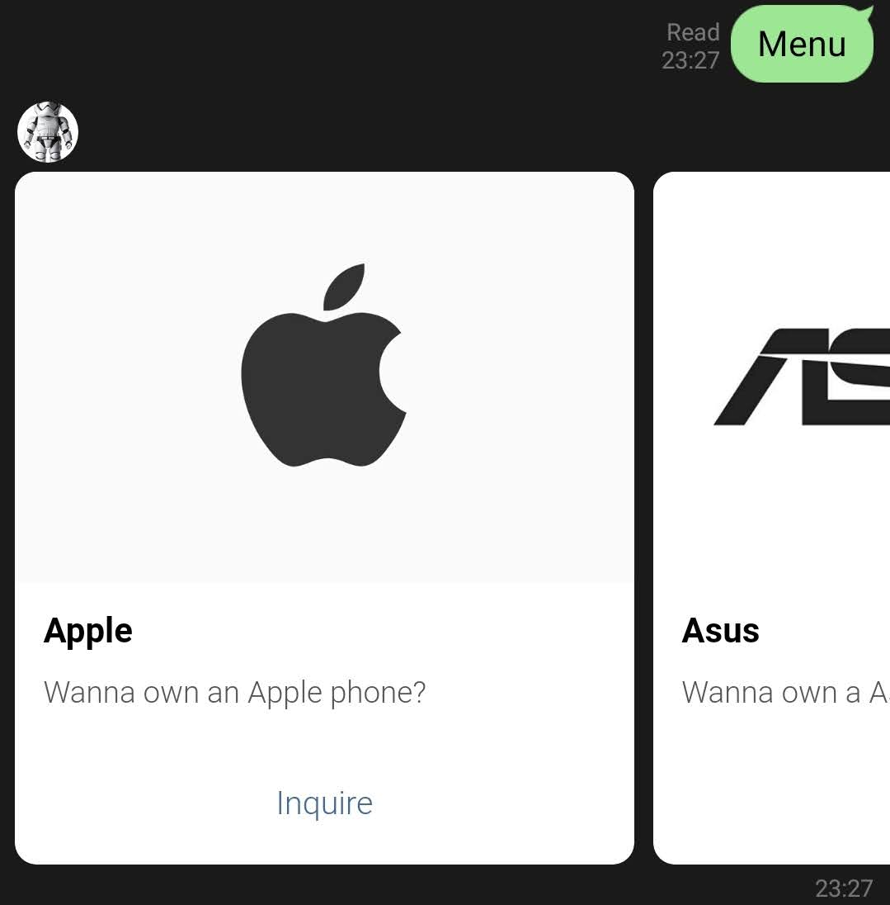
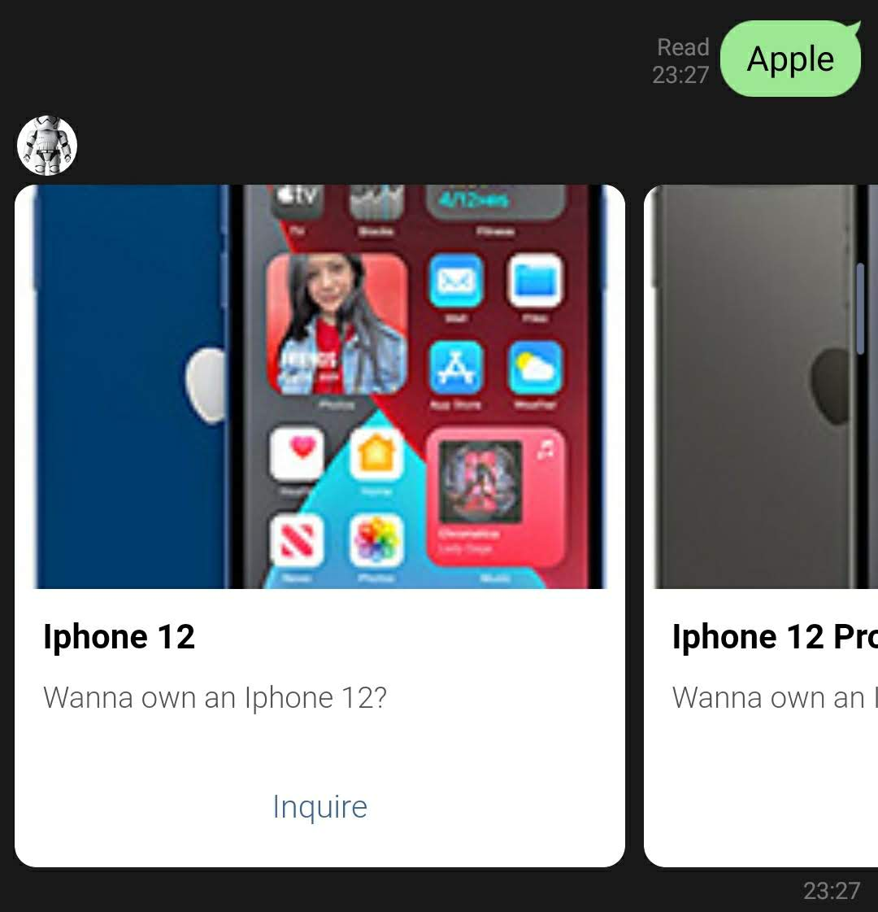
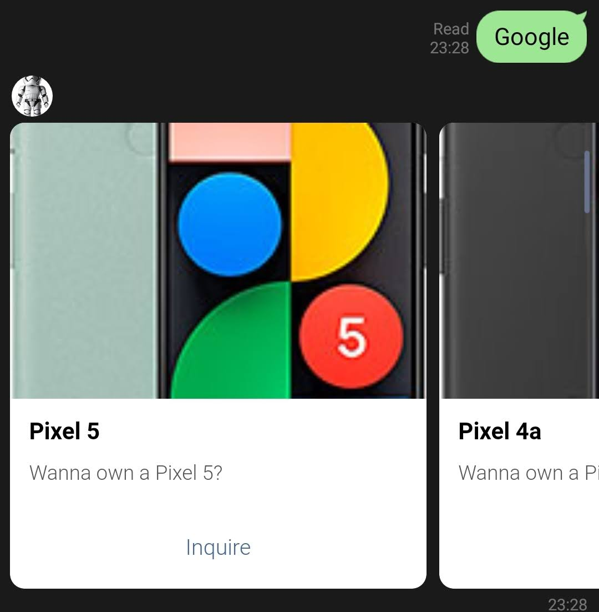
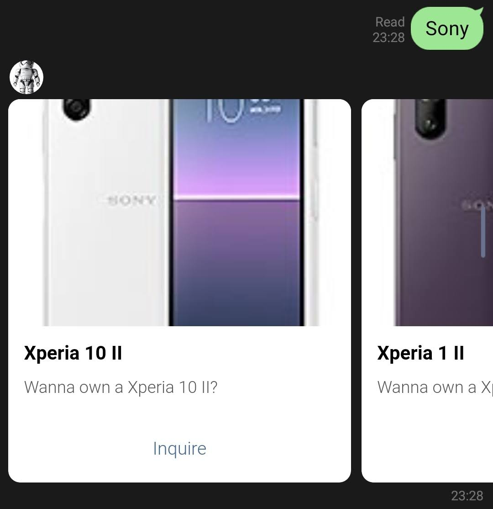
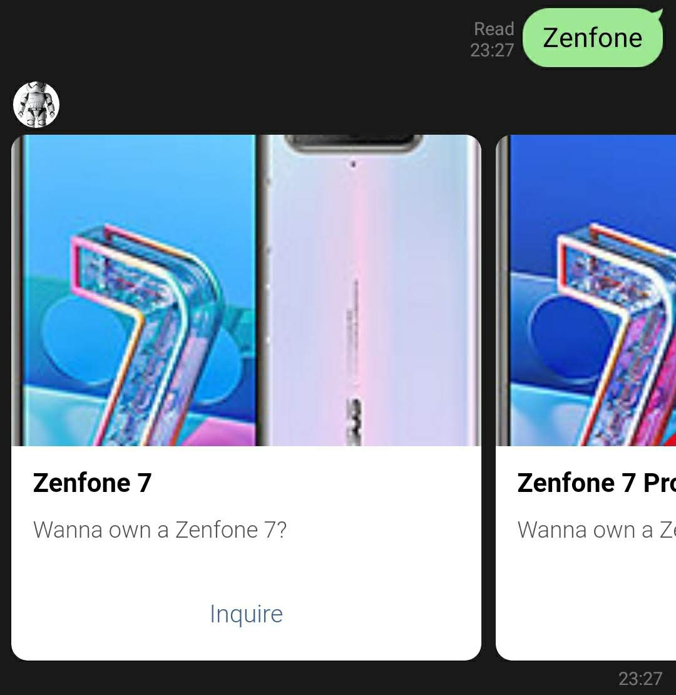
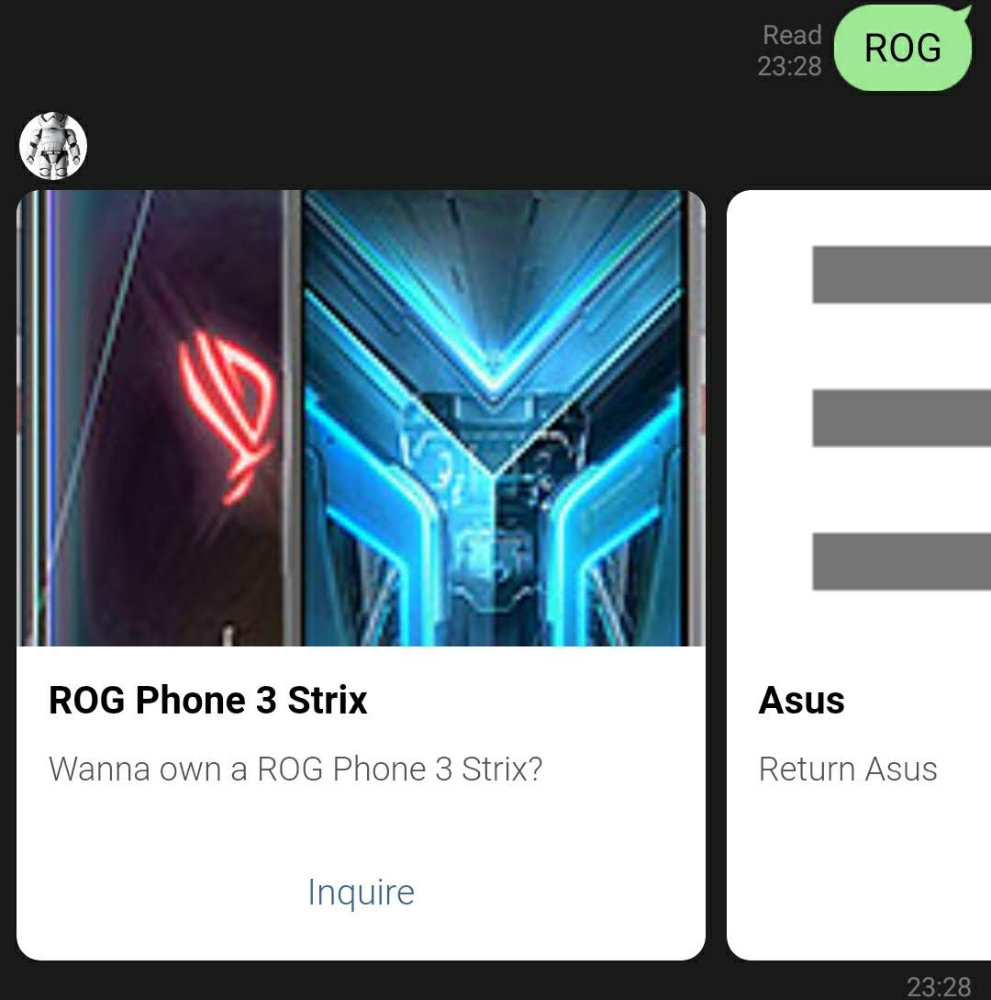
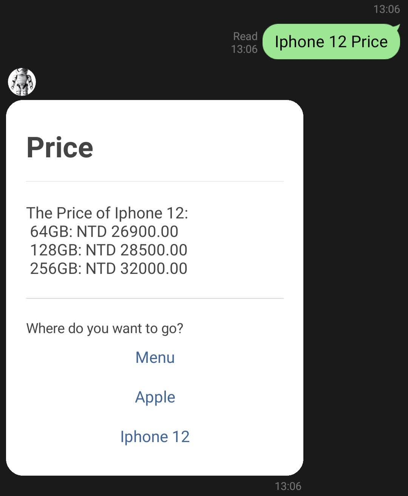
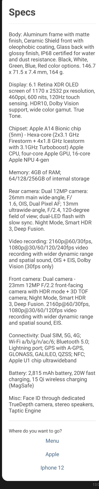

# TOC Project 2020

## ApAsSogo
## Finite State Machine

## Introduction

As the name suggest it means Apple, Asus, Sony, and Google. This chatbot is used to inform users about the price, specs, pros and cons, benchmark score, and review video of the chosen smartphones from Apple, Asus, Sony, and Google.

## Method
*  I manually selected and added specific phone brands and its phone models into my project.
*  I got the information about the price and benchmark score online and manually put it into my code. 
*  I've used python's Beautiful Soup to webscrape the specs and pros and cons of the selected phones for Asus, Sony, and Google in GSMArena for this project.

## Features

There are 5 main kinds of templates in my line chatbot's interface namely: Start, Menu, Brand, Phones, and FSM

### Start

    

In Start, the user will have no choice but to choose to go to Menu. The start only happens in the beginning or when the user wrote the wrong thing.

### Menu

    

In Menu, the user will choose which phone brands they would like to look into.

### Brand

    

    

    

    

Once user chooses a brand, they will be directed to the phone models of the brand but for Asus it will be the series. After the series is chosen, users will be 
directed to the phone models of that series.

    

    

### Phones

Once user chooses a phone, they have an option to choose know the information about the phone's price, specs, pros and cons, benchmark score, and video. For Apple, there
would be no video.
* Price

    

* Specs

    

* Pros and Cons

    

* Benchmark Score

    

* Video

    

### FSM

    

* Shows the FSM graph

## Reference
[Pipenv](https://medium.com/@chihsuan/pipenv-更簡單-更快速的-python-套件管理工具-135a47e504f4) ❤️ [@chihsuan](https://github.com/chihsuan)

[TOC-Project-2019](https://github.com/winonecheng/TOC-Project-2019) ❤️ [@winonecheng](https://github.com/winonecheng)

Flask Architecture ❤️ [@Sirius207](https://github.com/Sirius207)

[Line line-bot-sdk-python](https://github.com/line/line-bot-sdk-python/tree/master/examples/flask-echo)

### Information taken from

[Phones](https://gsmarena.com/)

[Benchmark Score](https://www.kimovil.com/en/)

Prices are taken from either the brand's offical web page or https://phoneaqua.com/

